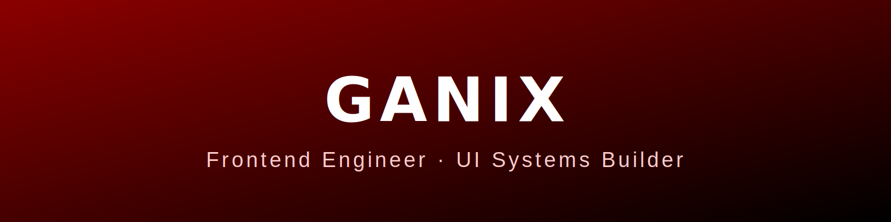

  

# Hi, I'm **Ganix**  
**Frontend Engineer & UI Systems Builder**

I build clean, fast, scalable interfaces — with a focus on component architecture, predictable UI systems, and performance-focused layouts.  
No bloat, no unnecessary complexity — just solid engineering.

---

## 🚀 Tech I Actually Use  
Everything listed here is part of my real workflow.

### **Languages / Core**
- TypeScript  
- JavaScript  
- Python  
- HTML  
- CSS  
- C++ (only when low-level performance matters)

### **Frontend**
- React  
- UI Architecture  
- Component Systems  

---

## 📌 Highlighted Project  

### **🔹 Portfolio Website**  
**Repo:** [`ganix0911/portfolio`](https://github.com/ganix0911/portfolio)

A modern, high-performance portfolio built with clean UI structure, real animation flow, and consistent responsive behavior.

---

## 🐍 Activity Snake (Dark Mode)

  

> Want the automation? I can generate the GitHub Actions workflow for the snake animation.

---

## 🔗 Reach Me  

- **GitHub:** https://github.com/Ganix0911
